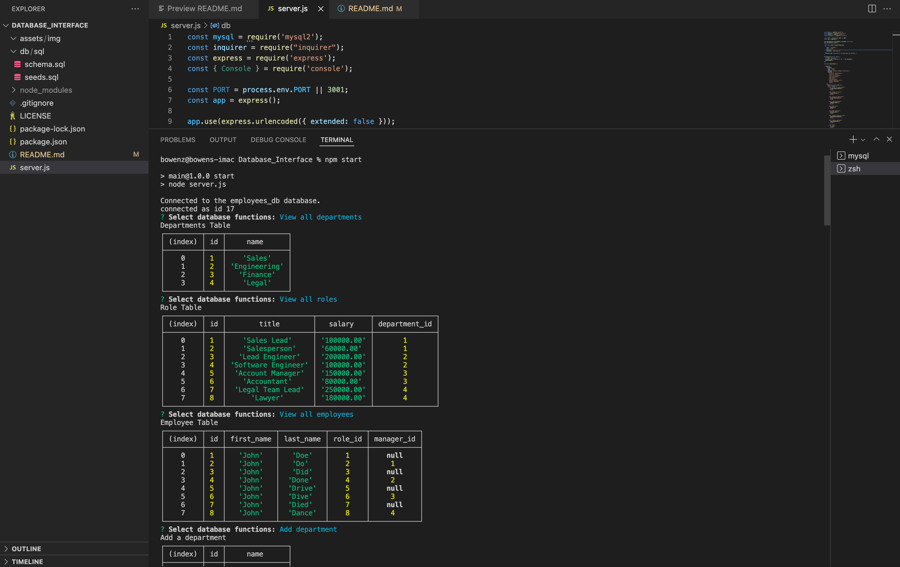
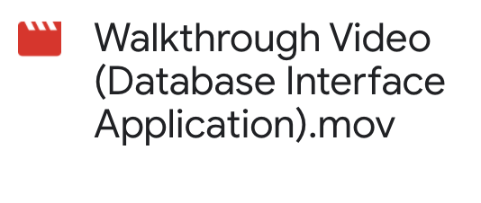

# Database Interface Employee Management Application

---
## Description

**content management systems (CMS)**. 

This ia a command-line application that be used to manage a company's employee database, using Node.js, Inquirer, and MySQL.
 

---
## Table of Contents

- [Installation](##Installation)

- [Usage](##Usage)

- [License](##License) 

- [Tests](##Tests)

- [Questions](##Questions)

---
## Installation

- First, use git clone in the terminal to download the project 
- Then open the project in VS Code and in the package.json folder enter the terminal 
- Within the terminal, use npm install to install the required packages
- Start mysql server and source the schema and seeds in the terminal
- The command-line application should work when node index.js or npm start is entered into the terminal 

---
## Usage

This command-line application can be used to manage a company's employee database.

### Screenshot:

### Walkthrough Video: Click to watch!

--- 
 
 ## License 
 
 https://opensource.org/licenses/MIT

---
## Tests

There are no tests for this application.

---
## Questions

If you have any questions or concerns please contact me at bxz5089@gmail.com or checkout my GitHub page at [bxz5089](https://github.com/bxz5089/).

